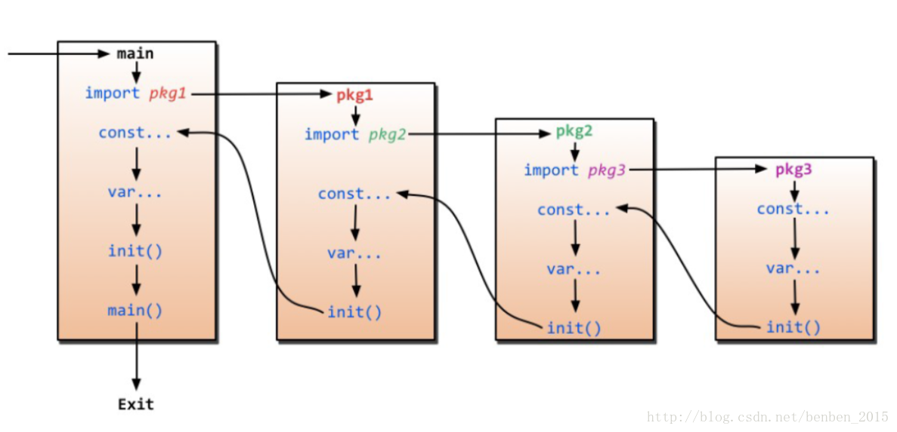
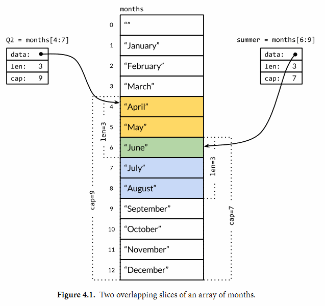
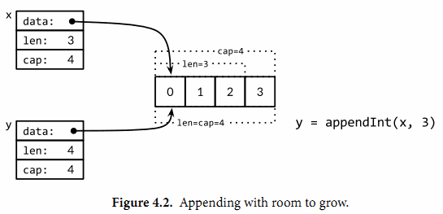
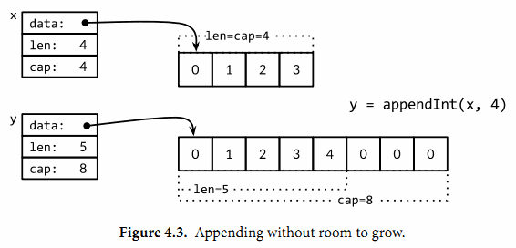
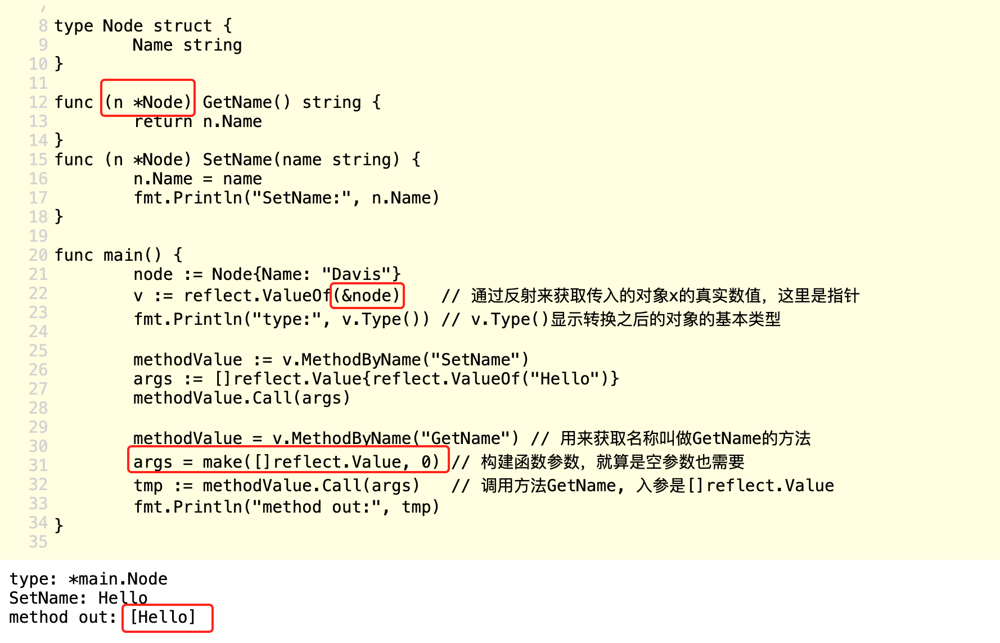
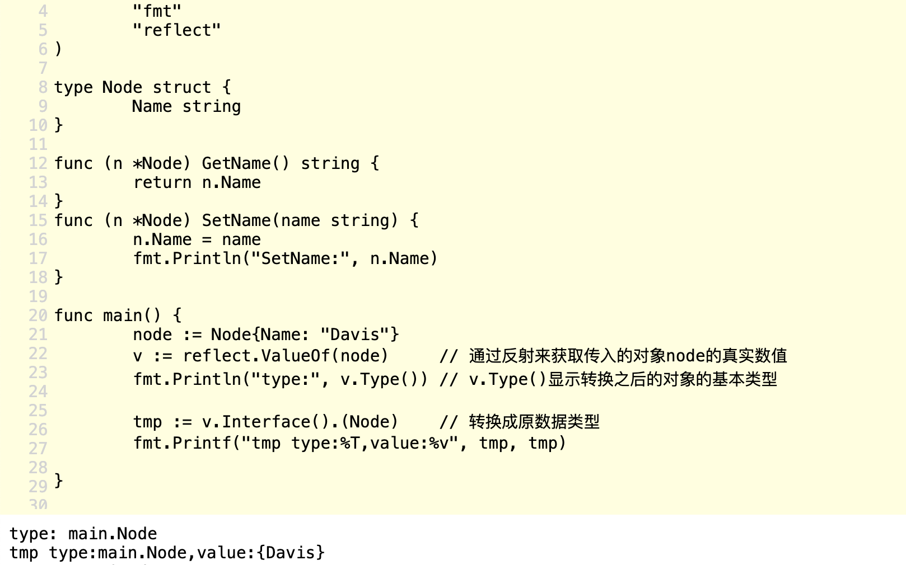
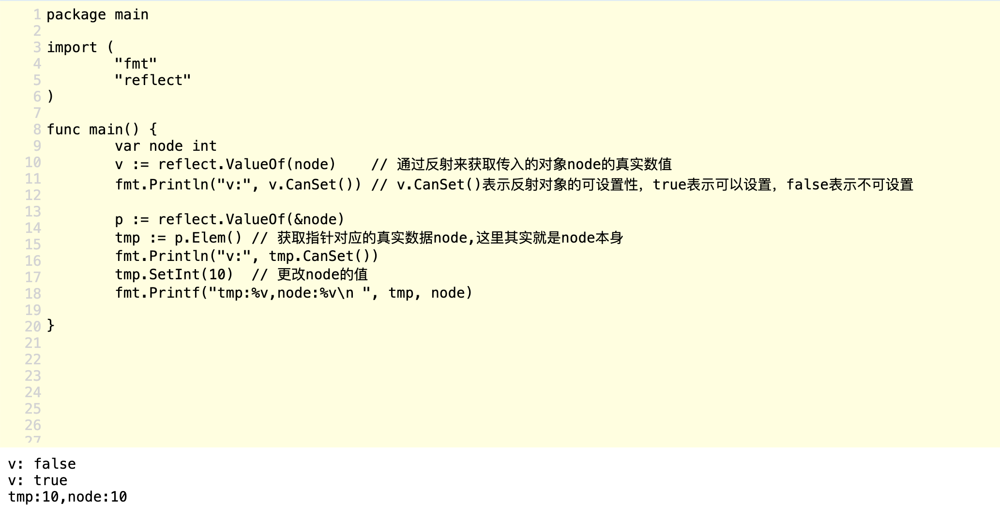
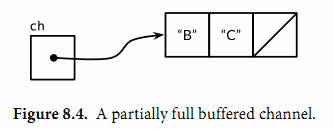

---
layout: post
title: "Golang初学"
description: "初学笔记"
tag: markdown
---   

## 结构  
### 包
1. 组成
    + 每个包都对应一个独立的名字空间
    + 一个或多个.go源文件组成
    + 一般地，一个包所在目录路径的后缀是包的导入路径
    + 包还可以让我们通过控制哪些名字是外部可见的来隐藏内部实现信息。 在Go语言中， 一个简单的规则是： 如果一个名字是大写字母开头的， 那么该名字是导出的
    + 包注释的第一句应该先是包的功能概要说明；包一般在一个源文件中有关于本包的注释，也可以多个包，同时也可以在某个独立的包中专门写注释，例如doc.go
    + 一个包中可以有一个或多个init()函数(被外部导入时，有且只执行一次，一般用来做初始化工作)
    + 此外，变量的初始化工作可以用init()函数执行，也可以通过匿名函数执行，例如：
```   
var arrs [100]byte = func() (arrs [100]byte) {
	for i := range arrs{
		if i==0 {
			arrs[i] = 1
		}else{
			arrs[i] = arrs[i-1]+1
		}
	}
	return arrs
}()
```
2. 导入其它包
	+ 导入的包不用，就会报错；如果只想导入后执行初始化工作，可```import _ tempconv```
	+ 导入包的执行顺序如下图：   
### 作用域
声明语句的作用域是指源代码中可以有效使用这个名字的范围。
特点：
+ 一个程序可能包含多个同名的声明， 只要它们在不同的词法域就没有关系；
+ 它首先从最内层的词法域向全局的作用域查找。 如果查找失败， 则报告“未声明的名字”这样的错误。 如果该名字在内部和外部的块分别声明过， 则内部块的声明首先被找到。 在这种情况下， 内部声明屏蔽了外部同名的声明， 让外部的声明的名字无法被访问。(**可重名，由内而外地搜**)

1.全局作用域
+ 对于内置的类型、 函数和常量， 比如int、len和true等是在全局作用域的， 因此可以在整个程序中直接使用。;
2.包作用域
+ 任何在在函数外部（ 也就是包级语法域） 声明的名字可以在同一个包的任何源文件中访问的。
3..go源文件作用域
+ 对于导入的包， 例如tempconv导入的fmt包， 则是对应源文件级的作用域， 因此只能在当前的文件中访问导入的fmt包， 当前包的其它源文件无法访问在当前源文件导入的包。
4.函数局部作用域
+ 在函数体内语句块中进行声明
5.控制语句的作用域
+ 控制流标号， 就是break、 continue或goto语句后面跟着的那种标号， 则是函数级的作用域;
```
func main() {
    x := "hello!"
	for i := 0; i < len(x); i++ {
        x := x[i]
        if x != '!' {
        	x := x + 'A' - 'a'
			fmt.Printf("%c", x) // "HELLO" (one letter per iteration)
		}
	}
}
//当然不提倡这样的编码
```

案例(作用域引起的问题)：
```
var cwd string //包作用域

func init() {
	cwd, err := os.Getwd() // NOTE: wrong!此处cwd是局部变量
	if err != nil {
		log.Fatalf("os.Getwd failed: %v", err)
    } 
    log.Printf("Working directory = %s", cwd)
}
```
```
//改为
var cwd string
func init() {
	var err error //局部作用域内没有声明cwd变量
	cwd, err = os.Getwd()
	if err != nil {
		log.Fatalf("os.Getwd failed: %v", err)
	}
}
```
## 基础数据类型
包含整数、浮点数、复数、布尔值、字符串、常量。
### 字符串
1. 特征
	+ Go语言中字符串的字节使用UTF-8编码表示Unicode文本;
	+ Go语言字符串是变宽字符序列，每一个字符都用一个或者多个字节表示，这跟其他的（C++，Java，Python 3）的字符串类型有着本质上的不同，后者为定宽字符序列;
	+ Go语言中只有在字符串只包含7位的ASCII字符（因为它们都是用一个单一的UTF-8字节表示）时才可以被字节索引;
2. 使用
	+ 双引号（支持转义字符、不支持多行书写）或者反引号创建字符串（支持多行、不支持转义）
```
text1 := "\"Hello GoLang\",I said"
text2 :=`"Hello GoLang",I said`  //这个在Java中就无法编译成功
```
3. 添加字符串
可以直接使用```+ +=```，但是效率不高；
推荐使用```byte.Buffer```类型
4. 比较字符串
Go语言中的字符串是支持常规的比较操作（<，>，==，!=，<=，>=），这些操作符会在内存中一个字节一个字节的比较，但是在执行比较操作时，常会出现以下三种问题：
	+ 有些 Unicode 编码的字符可以用两个或者多个不同的字节序列来表示。如果我们只关心ASCII字符，这个问题将不会存在，若是非ASCII字符，那么我们可以通过自定义标准化函数来隔离接受这些字符串。
	+ 用户希望将不同的字符看作是相同的。比如字符二，2，Ⅱ，②都可以看作相同的意思，那么用户输入2时，就得匹配这些相同意思的其他字符。这个也可以通过自定义标准化函数来解决。
	+ 字符的排序跟语言有关。
5. 遍历字符串
```
var s string = "n是什么ren"
	for _,v := range s{
		println(string(v)) //输出字符串
		println(v) //输出rune类型的整数
	}
```
6. 字符串切片
```
var s string = "n是什么ren"
println(s[3]) //得到的是字节序列
println(string(s[3]))

ss := []rune(s) //按字符进行切片
println(ss[3]) 
println(string(ss[3])) //么
```
### 常量
常量表达式的值在编译期计算，而不是在运行期。
1. 使用常量
```
const (
	a = 1
	b
	c = 2
	d
)

//借助iota，递增赋值
type Weekday int

const (
	Sunday Weekday = iota
	Monday
	Tuesday
	Wednesday
	Thursday
	Friday
	Saturday
)
```
## 复合数据类型
### 数组
**僵化的长度信息**
+ 数组是一个由固定长度的特定类型元素组成的序列，一个数组可以由零个或多个元素组成。
+ 数组的每个元素可以通过索引下标来访问，索引下标的范围是从0开始到数组长度减1的位置。
+ 当调用一个函数的时候，函数的每个调用参数将会被赋值给函数内部的参数变量，所以函数参数变量接收的是一个复制的副本，并不是原始调用的变量。
+ 可以显式地传入一个数组指针，那样的话函数通过指针对数组的任何修改都可以直接反馈到调用者。
### Slice
+ Slice（切片）代表变长的序列，序列中每个元素都有相同的类型。
+ slice的底层确实引用一个数组对象。
+ 一个slice由三个部分构成：指针、长度和容量。
+ 多个slice之间可以共享底层的数据，并且引用的数组部分区间可能重叠。

+ 切片操作超出cap(s)的上限将导致一个panic异常，但是超出len(s)则是意味着扩展了slice。
+ 因为slice值包含指向第一个slice元素的指针，因此向函数传递slice将允许在函数内部修改底层数组的元素。**函数形参为Slice类型，即为引用传递**
+ 不能使用==操作符来判断两个slice是否含有全部相等元素.
+ slice唯一合法的比较操作是和nil比较。
```
if summer == nil { /* ... */ }
```
+ 内置的make函数创建一个指定元素类型、长度和容量的slice。
```
make([]T, len) //容量部分可以省略，在这种情况下，容量将等于长度。
make([]T, len, cap) // same as make([]T, cap)[:len]
```
+ slice只引用了底层数组的前len个元素，但是容量将包含整个的数组。
+ append()函数：通常我们并不知道append调用是否导致了内存的重新分配，因此我们也不能确认新的slice和原始的slice是否引用的是相同的底层数组空间。同样，我们不能确认在原先的slice上的操作是否会影响到新的slice。因此，通常是将append返回的结果直接赋值给输入的slice变量：
```
runes = append(runes, r)
```


### Map
+ map就是一个哈希表的引用，map类型可以写为map[K]V，其中K和V分别对应key和value。
+ 其中K必须是可以用==进行比较的数据类型。
+ 创建Map的方式
```
var map1 = make(map[string]int)
var map2 = map[string]int{
	......
}
var map3 = map[string]int{} //创建空的map

//删除操作
delete(ages, "alice") // remove element ages["alice"]
```
+ map中的元素并不是一个变量，因此我们不能对map的元素进行取址操作
```
_ = &ages["bob"] // compile error: cannot take address of map element
```
+ Map的迭代顺序是不确定的，并且不同的哈希函数实现可能导致不同的遍历顺序。——可以借助keys的Slice进行按序访问
+ 向一个nil值的map存入元素将导致一个panic异常
```
var ages map[string]int
fmt.Println(ages == nil)    // "true"
fmt.Println(len(ages) == 0) // "true"

ages["carol"] = 21 // panic: assignment to entry in nil map
```
+ 不确定性地访问map中的键值对
```
age, ok := ages["bob"]
if !ok { /* "bob" is not a key in this map; age == 0. */ }
```
+ 和slice一样，map之间也不能进行相等比较。
+ Go语言中并没有提供一个set类型，但是map中的key也是不相同的，可以用map实现类似set的功能。**value为boolean类型或者其它，仅key位置有含义，则实现set功能**
### 结构体
+ 结构体是一种聚合的数据类型，是由零个或多个任意类型的值聚合成的实体。
+ 结构体变量的成员可以通过点操作符访问。
+ 可以对对成员取地址，然后通过指针访问。
```
position := &dilbert.Position
*position = "Senior " + *position // promoted, for outsourcing to Elbonia
```
+ 点操作符也可以和指向结构体的指针一起工作，即**结构体变量指针就可以使用点操作符。
```
var employeeOfTheMonth *Employee = &dilbert
employeeOfTheMonth.Position += " (proactive team player)"

//相当于
(*employeeOfTheMonth).Position += " (proactive team player)"
```
+ 函数的返回值为结构体的指针，返回值可以直接用点操作符，因为程序可以判定它为变量；**反之换成结构体，就不行**
+ 结构体成员的输入顺序也有重要的意义，顺序不同就不是同一个结构体。
+ 内部大写的变量，是可以被外包导出的。
+ 一个命名为S的结构体类型将不能再包含S类型的成员；但是S类型的结构体可以包含*S指针类型的成员。**因此，借助结构体指针可以是实现TreeNode**
+  结构体面值
```
type Point struct{ X, Y int }

p := Point{1, 2} //按顺序赋值，内包中才可以实现

//1
pp := &Point{1, 2}

//2
pp := new(Point) //返回该数据类型的内存地址，即用指针类型接受
*pp = Point{1, 2}
```
+ 结构体作为形参：在函数内部修改结构体成员的话，用指针传入是必须的；因为在Go语言中，所有的函数参数都是值拷贝传入的，函数参数将不再是函数调用时的原始变量。
+ 结构体比较：如果结构体的全部成员都是可以比较的，那么结构体也是可以比较的，那样的话两个结构体将可以使用==或!=运算符进行比较。相等比较运算符==将比较两个结构体的每个成员。**可比较的结构体类型和其他可比较的类型一样，可以用于map的key类型。**
+ 结构体嵌入和匿名成员：语法糖只适用于内包中
```
type Point struct {
	X, Y int
}
//嵌入匿名成员，在内包中访问成员变量时，可以使用语法糖
type Circle struct {
	Point
	Radius int
}
//嵌入匿名成员，在内包中访问成员变量时，可以使用语法糖
type Wheel struct {
	Circle
	Spokes int
}

//繁琐的写法
var w Wheel
w.Circle.Center.X = 8
w.Circle.Center.Y = 8
w.Circle.Radius = 5
w.Spokes = 20

//语法糖
var w Wheel
w.X = 8            // equivalent to w.Circle.Point.X = 8
w.Y = 8            // equivalent to w.Circle.Point.Y = 8
w.Radius = 5       // equivalent to w.Circle.Radius = 5
w.Spokes = 20

//结构体字面值并没有简短表示匿名成员的语法
w = Wheel{8, 8, 5, 20}                       // compile error: unknown fields
w = Wheel{X: 8, Y: 8, Radius: 5, Spokes: 20} // compile error: unknown fields

//正确的表示方式
w = Wheel{Circle{Point{8, 8}, 5}, 20}
```
### JSON
1. marshal
```
type Movie struct {
	Title  string
	Year   int  `json:"released"`
	Color  bool `json:"color,omitempty"`
	Actors []string
}

var movies = []Movie{
	{Title: "Casablanca", Year: 1942, Color: false,
		Actors: []string{"Humphrey Bogart", "Ingrid Bergman"}},
	{Title: "Cool Hand Luke", Year: 1967, Color: true,
		Actors: []string{"Paul Newman"}},
	{Title: "Bullitt", Year: 1968, Color: true,
		Actors: []string{"Steve McQueen", "Jacqueline Bisset"}},
	// ...
}

//1.直接marshal
data, err := json.Marshal(movies)
if err != nil {
	log.Fatalf("JSON marshaling failed: %s", err)
}
fmt.Printf("%s\n", data)

//2.有格式地marshal
data, err := json.MarshalIndent(movies, "", "    ")
if err != nil {
	log.Fatalf("JSON marshaling failed: %s", err)
}
fmt.Printf("%s\n", data)
```
2. unmarshal
	+ 将JSON格式的电影数据解码为一个结构体slice，结构体中只有Title成员。通过定义合适的Go语言数据结构，我们可以选择性地解码JSON中感兴趣的成员。当Unmarshal函数调用返回，slice将被只含有Title信息值填充，其它JSON成员将被忽略。
```
var titles []struct{ Title string }
if err := json.Unmarshal(data, &titles); err != nil {
	log.Fatalf("JSON unmarshaling failed: %s", err)
}
fmt.Println(titles) // "[{Casablanca} {Cool Hand Luke} {Bullitt}]"
```
3. tag
```
//Tag中json对应值的第一部分用于指定JSON对象的名字
Year  int  `json:"released"`
//额外的omitempty选项，表示当Go语言结构体成员为空或零值时不生成
Color bool `json:"color,omitempty"` 
```
## 函数
一个函数主要包含两个信息:函数签名和函数体，**函数的签名包括参数类型，返回值的类型，函数签名可以看做是函数的类型```type func(int,int) int```**，函数的函数体即函数的值。
### 声明
1. Golang函数可以当作一个数据结构，由形参类型和个数以及返回值类型和个数决定；
```
func main(){
	var a,b = 1,2
	println(getItem(a, b, add))
}

//定义一个数据类型的函数
type Functype func(int,int) int 

func add(a,b int) int{
	return a+b
}

//使用有名返回值和函数数据结构
func getItem(a,b int,f Functype) (res int){
	res = f(a,b)
	return
}
```
2. 有名返回值，可以裸返(*不宜过度使用bare return*)
```
func mytest() (z int){
	z = 1
	return
}

func main(){
	x := mytest()
	println(x) //1
}
```
3. 值传递。**但是，如果实参包括引用类型，如指针，slice(切片)、map、function、channel等类型，实参可能会由于函数的简介引用被修改。**
### 递归函数
和其它语言不同的是，Go语言使用可变栈，栈的大小按需增加(初始时很小)。这使得我们使用递归时不必考虑溢出和安全问题。
### 可以有多返回值
### 函数值（联系函数被当成type）
+ 函数被看作第一类值（first-class values）：函数像其他值一样，拥有类型，可以被赋值给其他变量，传递给函数，从函数返回。
+ 函数类型的零值是nil。调用值为nil的函数值会引起panic错误。
+ 函数值之间是不可比较的，也不能用函数值作为map的key。
```
func main(){
	var f func(int,int) int
	if f==nil{
		println("现在f是nil")
	}
	
	//赋值
	f = add

	println(f(2,2))
}

func add(a,b int) int{
	return a+b
}

```
### 可变参数
参数数量可变的函数称为为可变参数函数。
```
func main(){
	println(add(1, 2, 3, 4)) //形参当作Slice类型的数据进行处理
	var nums = []int{1,2,3,4}
	println(add(nums...)) //当真传入Slice类型的数据时，需要加 ...
}

//在声明可变参数函数时，需要在参数列表的最后一个参数类型之前加上省略符号“...”
func add(vals ...int) int {
	var res int
	for _,v := range vals{
		res += v
	}

	return res
}
```
### 匿名函数
在Go语言中，函数是一等公民，也就是说，函数可以被赋值或者当作返回值和参数进行传递。
在很多时候我们并不需要一个有名字的函数（而且命名确实是一项相当费劲的事），所以我们在某些场景下可以选择使用 匿名函数 。
```
//简单匿名函数示例
func main(){
    hello := func(){
        fmt.Println("Hello World")
    }
    hello()
}

//匿名函数当成形参
func main(){
    doPrint("Hello World", func(s string){
		fmt.Println(s)
	})
}

type Printer func(string)

func doPrint(s string, printer Printer){
    printer(s)
}

//匿名当作返回值
func main(){
    getPrinter()("Hello World")
}

type Printer func(string)

func getPrinter()Printer{
    return func(s string){
		fmt.Println(s)
	}
}

//一个接收匿名函数的变量的类型便是由函数的签名决定的
	//一个匿名函数被赋值给一个变量后，这个变量便只能接收同样签名的函数。
```
匿名函数 跟普通函数的微小区别在于 **匿名函数 赋值的变量可以重新设置新的 匿名函数**，但普通函数的函数名是与特定函数绑定的，无法再将其它函数赋值给它。这就类似于变量与常量之间的区别
### 闭包
+ 闭包 = 函数 + 引用环境；引用环境 是指在程序执行中的某个点所有处于活跃状态的变量所组成的集合。
+ 当每次调用包含闭包的函数时都将返回一个新的闭包实例，这些实例之间是隔离的。
+ 闭包把函数和运行时的引用环境打包成为一个新的整体。
```
func adder() func() int {
	var i = 0
	return func() int {
		i++
		return i
	}
}

func main() {
	a := adder()
	fmt.Println(a())
	fmt.Println(a())
	fmt.Println(a())
	fmt.Println(a())
	//产生了新的闭包实例
    b := adder()
	fmt.Println(b())
	fmt.Println(b())
}

//1 2 3 4 1 2
```
**本质**:闭包 会让被引用的局部变量从栈逃逸到堆上，从而使其能在其作用域范围之外存活。闭包 “捕获”了和它在同一作用域的其它常量和变量。这就意味着当闭包被调用的时候，不管在程序什么地方调用，闭包能够使用这些常量或者变量。
### defer
在函数调用的前面加defer，实现FILO的功能；
可当作Java中Finally的用法，进行释放锁资源、关闭文件等操作。
```
var (
    // 一个演示用的映射
    valueByKey      = make(map[string]int)
    // 保证使用映射时的并发安全的互斥锁
    valueByKeyGuard sync.Mutex
)

func readValue(key string) int {
    valueByKeyGuard.Lock()
   
    // defer后面的语句不会马上调用, 而是延迟到函数结束时调用
    defer valueByKeyGuard.Unlock()
    return valueByKey[key]
}

func fileSize(filename string) int64 {
    f, err := os.Open(filename)
    if err != nil {
        return 0
    }
    // 延迟调用Close, 此时Close不会被调用
    defer f.Close()
    info, err := f.Stat()
    if err != nil {
        // defer机制触发, 调用Close关闭文件
        return 0
    }
    size := info.Size()
    // defer机制触发, 调用Close关闭文件
    return size
}
```
深度理解defer：待补充  
### panic
+ 的类型系统会在编译时捕获很多错误，但有些错误只能在运行时检查，如数组访问越界、空指针引用等。这些运行时错误会引起painc异常。
+  panic 会引起程序的崩溃，因此 panic 一般用于严重错误，如程序内部的逻辑不一致。任何崩溃都表明了我们的代码中可能存在漏洞，所以对于大部分漏洞，我们应该使用Go语言提供的错误机制，而不是 panic。
+  Go语言可以在程序中手动触发宕机，让程序崩溃，这样开发者可以及时地发现错误，同时减少可能的损失。*例如：在运行依赖的必备资源缺失时主动触发宕机*
```
//该函数可以手动进行宕机
func panic(v interface{})    //panic() 的参数可以是任意类型的。
```
+ 当 panic() 触发的宕机发生时，panic() 后面的代码将不会被运行，但是**panic() 函数前面已经运行过的 defer 语句依然会在宕机发生时发生作用。类似于try-finally的功能。**
### recover()捕捉异常
```
package main

import (
	"fmt"
	"runtime"
)

// 崩溃时需要传递的上下文信息
type panicContext struct {
	function string // 所在函数
}

// 保护方式允许一个函数
func ProtectRun(entry func()) {

	// 延迟处理的函数
	defer func() {

		// 发生宕机时，获取panic传递的上下文并打印
		err := recover()

		switch err.(type) {
		case runtime.Error: // 运行时错误
			fmt.Println("runtime error:", err)
		default: // 非运行时错误
			fmt.Println("error:", err)
		}

	}()

	entry()

}

func main() {
	fmt.Println("运行前")

	// 允许一段手动触发的错误
	ProtectRun(func() {

		fmt.Println("手动宕机前")

		// 使用panic传递上下文
		panic(&panicContext{
			"手动触发panic",
		})

		fmt.Println("手动宕机后")
	})
	
	//!!!因为上面defer中有recover捕捉了异常，那么下面的代码依然可以运行
	// 故意造成空指针访问错误
	ProtectRun(func() {

		fmt.Println("赋值宕机前")

		var a *int
		*a = 1

		fmt.Println("赋值宕机后")
	})

	fmt.Println("运行后")
}

//输出
/*
运行前
手动宕机前
error: &{手动触发panic}
赋值宕机前
runtime error: runtime error: invalid memory address or nil pointer dereference
运行后
*/
```
### 错误
在Go的错误处理中，错误是软件包API和应用程序用户界面的一个重要组成部分，程序运行失败仅被认为是几个**预期**的结果之一。
对于那些将运行失败看作是预期结果的函数，它们会返回一个额外的返回值，通常是最后一个，来传递错误信息。如果导致失败的原因只有一个，额外的返回值可以是一个布尔值，通常被命名为ok，也会是多种原因，则是error类型。
*错误处理方式待补充*  
## 方法
OOP思想中的方法
### 声明
在函数声明时，在其名字之前放上一个变量，即是一个方法。这个附加的参数会将该函数附加到这种类型上，即相当于为这种类型定义了一个独占的方法。
```
package main

func main() {
	var path = Path{1,2,3}
	var r = Route{[]int{1,2,3}}
	//方法调用都是点式调用
	println(path.Distance())
	println(r.Distance())
}

type Path []int

//可以为一些简单的数值、字符串、slice、map来定义一些附加方法
func (path Path) Distance() int{
	var res int
	for _,v := range path{
		res += v
	}
	return res
}

//可以为结构体类型添加方法
type Route struct {
	length []int
}

func (r Route) Distance() int{
	var res int
	for _,v := range r.length{
		res += v
	}
	return res
}
```
函数和方法的区别：
```
p := Point{1, 2}
q := Point{4, 6}
fmt.Println(Distance(p, q)) // "5", function call
fmt.Println(p.Distance(q))  // "5", method call
```
### 基于指针对象的方法
1. 不管你的method的receiver是指针类型还是非指针类型，都是可以通过指针/非指针类型进行调用的，编译器会帮你做类型转换。
2. 在声明一个method的receiver该是指针还是非指针类型时，你需要考虑两方面的因素，第一方面是这个对象本身是不是特别大，如果声明为非指针变量时，调用会产生一次拷贝；第二方面是如果你用指针类型作为receiver，那么你一定要注意，这种指针类型指向的始终是一块内存地址(**是引用传递的意思**)，就算你对其进行了拷贝。熟悉C或者C++的人这里应该很快能明白。  
### Nil也是一个合法的接收器类型
```
// An IntList is a linked list of integers.
// A nil *IntList represents the empty list.
//当你定义一个允许nil作为接收器值的方法的类型时，在类型前面的注释中指出nil变量代表的意义是很有必要的
type IntList struct {
    Value int
    Tail  *IntList
}
// Sum returns the sum of the list elements.
func (list *IntList) Sum() int {
    if list == nil {
        return 0
    }
    return list.Value + list.Tail.Sum()
}
```
### 借助嵌入方式来扩展结构体
嵌入的方式扩展结构体，也会带来子类型的方法，示例如下：
```
func main() {
	var x = Route{1,Path{1,2,3}}
	x.Distance()
	println(x.length) //2
	var y = x.Distance1() 
	println(y) //6
}

type Path []int

func (path Path) Distance1() int{
	var res int
	for _,v := range path{
		res += v
	}
	return res
}

type Route struct {
	length int
	Path
}

func (r *Route) Distance(){
	r.length++
}
```
下面的示例：首先去找直接定义在这个类型里的ScaleBy方法，然后找被ColoredPoint的内嵌字段们引入的方法，然后去找Point和RGBA的内嵌字段引入的方法，然后一直递归向下找。
```
type ColoredPoint struct {
    *Point
    Color color.RGBA
}

p := ColoredPoint{&Point{1, 1}, red}
q := ColoredPoint{&Point{5, 4}, blue}
fmt.Println(p.Distance(*q.Point)) // "5"
q.Point = p.Point                 // p and q now share the same Point
p.ScaleBy(2)
fmt.Println(*p.Point, *q.Point) // "{2 2} {2 2}"
```
### 方法正常调用/方法表达式调用/方法值调用
关于方法的另一种理解：p.Distance叫作“选择器”，选择器会返回一个方法"值"->一个将方法(Point.Distance)绑定到特定接收器变量的函数。
```
type People struct {
	name string
	age int
}

func (p *People) addAgePointer() {
	println("addAgePointer()")
	p.age++
}

func (p People) addAgeValue() {
	println("addAgeValue()")
	p.age++
}

func main(){
	var p1 = People{"chenzhen",25}

	//常规调用
	p1.addAgeValue()
	p1.addAgePointer()

	//方法表示式
	pointer1 := (*People).addAgePointer
	pointer1(&p1)

	Value1 := People.addAgeValue
	Value1(p1)

	//方法值
	pointer2 := p1.addAgePointer
	pointer2()
	value2 := p1.addAgeValue
	value2()
}

```
对于接收器是指针类型的，就是引用传递，不是则是值传递，同样这在**方法值调用中同样适用**！
```
func main() {
	var p1 = People{"chenzhen", 25}
	value := p1.addAgeValue
	value()
	println(p1.age) //25,因为是值传递，所以没有发生改变

	pointer := p1.addAgePointer
	pointer()
	println(p1.age) //26
}
```
### Golang封装（可以理解为OOP中的类）
示例：
```
package model
 
import "fmt"
 
type person struct {
    Name string
    age  int // 其它包不能直接访问
    sal  float64
}
 
// Newperson is
// 写一个工厂模式的函数，相当于构造函数
func Newperson(name string) *person {
    return &person{
        Name: name,
    }
}
 
// 为了访问sal和age，我们编写一对SetXXX和GetXXX的方法
func (p *person) Setage(a int) {
    if a > 0 && a < 150 {
        p.age = a
    } else {
        fmt.Println("您输入的年龄不正确！")
    }
}
 
func (p *person) Getage() int {
    return p.age
}
 
func (p *person) Setsal(s float64) {
    if s >= 3000 && s <= 30000 {
        p.sal = s
    } else {
        fmt.Println("薪水范围不正确！")
    }
}
 
func (p *person) Getsal() float64 {
    return p.sal
}
```
使用这个类
```
func main() {
    p := model.Newperson("sonder")
    p.Setage(23)
    p.Setsal(4500)
    // p.Getage()
    fmt.Println(p)
    fmt.Println(p.Getage())
    fmt.Println(p.Getsal())
}
```
## 接口
### 接口定义
+ 接口也是一种数据类型。
+ 接口类型具体描述了一系列方法的集合，一个实现了这些方法的具体类型是这个接口类型的实例。
+ 定义接口的几种方式如下；
```
//1.
type Reader interface {
    Read(p []byte) (n int, err error)
}
type Closer interface {
    Close() error
}

//2.
type ReadWriter interface {
    Reader
    Writer
}
type ReadWriteCloser interface {
    Reader
    Writer
    Closer
}

//3.
type ReadWriter interface {
    Read(p []byte) (n int, err error)
    Writer 同上，直接省略了形参和返回值
}
```
### 实现接口
+ 一个类型如果拥有一个接口需要的所有方法，那么这个类型就实现了这个接口。
```
package main

import "fmt"

func main(){
	var f Dinter
	f = Fadou{"小日本",1} //Fadou实现了Dinter的所有接口，就可以互通
	//倘若少实现一个方法，或者接收器是指针类型的话就不行，因为它是接口
	f.Sleep()
}

type Einter interface {
	Eat(thing string) (res string)
}

type Sinter interface {
	Sleep()
}

type Dinter interface {
	Einter
	Sinter
}

type Fadou struct{
	name string
	age int
}

func (f Fadou) Eat(thing string) (res string){
	res = thing
	return
}

func (f Fadou) Sleep(){
	fmt.Println(f.name,"睡觉了")
}
```
### 空接口
+ 当接口没有方法时，它被称为空接口。 这由interface{}表示。** 由于空接口没有任何方法，因此所有类型都实现了该接口。**
### 多接口
+ 某个struct实现了多个interface的方法
```
package main

import "fmt"

func main(){
	var f = Fadou{"小日本",1}
	var e Einter = f
	var s Sinter = f
	var d Dinter = f
	fmt.Printf("type:%T\n",e) //type:main.Fadou
	fmt.Printf("type:%T\n",s) //type:main.Fadou
	fmt.Printf("type:%T\n",d) //type:main.Fadou
	
	//没有这个方法
	e.Sleep() //e.Sleep undefined (type Einter has no field or method Sleep)
	s.Sleep()
	
}

type Einter interface {
	Eat(thing string) (res string)
}

type Sinter interface {
	Sleep()
}

type Dinter interface {
	Einter
	Sinter
}

type Fadou struct{
	name string
	age int
}

func (f Fadou) Eat(thing string) (res string){
	res = thing
	return
}

func (f Fadou) Sleep(){
	fmt.Println(f.name,"睡觉了")
}
```
### 类型断言
```
func main(){
	var f = Fadou{"小日本",1}
	var e Einter = f
	
	//本来Einter不具有Sinter的Sleep()方法，使用断言
	temp1 := e.(Sinter)
	temp1.Sleep()
	//因为不确定动态类型是否是该类型，所以用ok来接错位
	temp2,ok := e.(Dinter)
	if ok{
		temp2.Sleep()
	}
}
```
### 类型开关
借助```i.(type) switch```实现类型开关
```
func main(){
	explain("abc")
}

func explain(i interface{}){
	switch i.(type) {
	case string:
		println(strings.ToUpper(i.(string)))
	default:
		println(i)
	}
}
```
### 嵌入式接口
interface 和 struct 一样，都可以嵌入式
### 关于方法的接受器问题
+ 对于struct来说，指针接收器，对于值或指针都可以用；
+ 对于接口来说，指针就是指针，值就是值。
```
func main(){
	var f = Fadou{"小日本",1}
	var s Sinter
	s = &f //s是接口，接口对于指针接收器就要指针类型的值才可以调用方法
	s.Sleep()
}

type Einter interface {
	Eat(thing string) (res string)
}

type Sinter interface {
	Sleep()
}

type Dinter interface {
	Einter
	Sinter
}

type Fadou struct{
	name string
	age int
}

func (f Fadou) Eat(thing string) (res string){
	res = thing
	return
}

func (f *Fadou) Sleep(){
	fmt.Println(f.name,"睡觉了")
}
```
*一般而言，只要我们可以使用接口，我们就应该尽量使用它。*
## 反射
Go 语言提供了一种机制在**运行时**更新变量和检查它们的值、调用它们的方法，但是在编译时并不知道这些变量的具体类型，这称为反射机制。
### 类型和接口
由于反射是基于类型系统(type system)的，所以先简单了解一下类型系统。
```
type MyInt int
 
var i int
var j MyInt
```
+ i 是 int 类型的， j 是 MyInt 类型的。i 和 j 是不同的静态类型，尽管他们都有相同的相关类型（这里就是 int），他们不能互相赋值除非通过强制转换。
+ 一种非常重要的类型分类是接口类型，接口代表中方法的集合。只要一个值实现了接口定义的方法，那么这个值就可以存储这个具体的值。
+ 任何是实现了 Read (或 Write )方法的签名的类型就是实现了 io.Reader (或者 io.Writer)。也就是说**一个 io.Reader 的变量可以持有任何实现了 Read 方法的值**。
### reflect.Type Value
```
import (
	"fmt"
	"reflect"
)

func main(){

/*
	var x float32 = 1.0

	v := reflect.ValueOf(x)
	fmt.Println("type:",v.Type()) //type: float32

	if v.CanSet(){
		fmt.Println("v can set ") //v can not set
		v.SetFloat(1.6)
	}else {
		fmt.Println("v can not set")
	}

	p := reflect.ValueOf(&x)

	if p.CanSet(){
		fmt.Println("p can set ")
		p.SetFloat(1.6)
		v2 := p.Float()
		fmt.Println("p:",p," v2:",v2," x:",v)
	}else {
		fmt.Println("p can not set ") //p can not set
		v2 := p.Elem()
		if v2.CanSet(){
			fmt.Println("v2 can set ") //v2 can set
			v2.SetFloat(1.6)
			fmt.Println("v2:",v2.Float()," x:",x) //v2: 1.600000023841858  x: 1.6
			fmt.Println("v2地址:",v2.Addr()," x地址:",&x) //v2地址: 0xc00000a0b0  x地址: 0xc00000a0b0
		}else{
			fmt.Println("v2 can not set")
		}
	}*/

	type F int
	var f  = 1

	fmt.Println("type:",reflect.TypeOf(f)) //类型 type: int
	fmt.Println("value:",reflect.ValueOf(f)) //值 value: 1

	fmt.Println("------")

	v := reflect.ValueOf(f)
	fmt.Println("type:",v.Type()) //值的类型 type: int
	fmt.Println("kind is int?:",v.Kind() == reflect.Int) //类型的种类 kind is int?: true
	fmt.Println("concreate value:",v.Int()) //具体值 concreate value: 1
	//fmt.Println("原始数据值:",v.Elem()) //panic: reflect: call of reflect.Value.Elem on int Value

	fmt.Println("------")

	//使用指针类型
	v1 := reflect.ValueOf(&f)
	fmt.Println("type:",v1.Type()) //type: *int
	fmt.Println("kind:",v1.Kind()) //kind: ptr
	fmt.Println("Elem:",v1.Elem()) //1

	fmt.Println("------")

	//使用reflect.Value进行修改的没有成功
	if v1.CanSet(){
		v1.SetInt(2)
	}

	fmt.Println("修改后f的值为:",f) //1

	fmt.Println("------")

	//使用reflect.Type.Elem()进行修改,修改成功
	e := v1.Elem()
	if e.CanSet(){
		e.SetInt(2)
	}

	fmt.Println("使用reflect.Type.Elem()进行修改，修改后f的值为:",f) //2
}
```
总结：
+ Type——类型
+ Value——值
+ value.Type ——类型
+ value.Kind——类型的种类
+ 只有指针类型的数据的reflect.Value数据，才可以使用.Elem()，以此拿到值本身，这样进行修改时，才是对本身进行修改。
### 三大定律
1. 定律一：将空接口转换成反射对象

2. 定律二：将反射对象转换成原类型

3. 定律三：修改反射对象的值：eflect.ValueOf函数返回的是一份值的拷贝，所以直接对这个值进行修改是无意义的，因为它不会更改原来的那个值。要想修改原来的数值，需要借用指针的特性，进行修改，这里也就是定律三中提到的可设置性，通过Elem()来找到对应的原数据值。

## goroutines channels
### Channels
+ 一个channels是一个通信机制，它可以让一个goroutine通过它给另一个goroutine发送值信息。每个channel都有一个特殊的类型，也就是channels可发送数据的类型。
+ 和map类似，channel也一个对应make创建的底层数据结构的引用。
+ 创建
```
ch = make(chan int)    // unbuffered channel
ch = make(chan int, 0) // unbuffered channel
ch = make(chan int, 3) // buffered channel with capacity 3
```
+ 传输数据
```
ch <- x  // a send statement
x = <-ch // a receive expression in an assignment statement
<-ch     // 一个不使用接收结果的接收操作也是合法的
```
#### 消息事件
基于channels发送消息有两个重要方面。首先每个消息都有一个值，但是有时候通讯的事实和发生的时刻也同样重要。当我们更希望强调通讯发生的时刻时，我们将它称为消息事件。
——不带缓存的Channel，数据类型可以是```struct{} int bool```
```
func main() {
	conn, err := net.Dial("tcp", "localhost:8000")
	if err != nil {
		log.Fatal(err)
	}
	done := make(chan struct{}) //借助这个无缓存的Channel
	go func() {
		io.Copy(os.Stdout, conn) // NOTE: ignoring errors
		log.Println("done")
		done <- struct{}{} //通过向Channel中传数据，通知主线程
	}()
	mustCopy(conn, os.Stdin)
	conn.Close()
	<-done //等待其它工作线程做完
}
```
### 多个Channel实现pipeline传输
```
func main() {
	chan1 := make(chan int,10)
	chan2 := make(chan int,10)

	go func() {
		for i:=0;i<10;i++{
			chan1 <- i
		}

		close(chan1)
	}()

	go func() {
		//直接借助range遍历Channel,当没有可接受的值或者Channel关闭，就直接退出循环
		for v := range chan1{
			chan2 <- v*v
		}
		close(chan2)
	}()

	for v := range chan2{
		println(v)
	}
}
```
### 单向Channel
```chan<- {type}```表示只能往管道中添加数据的管道
```<-chan {type}```表示只能从管道中取数据的管道
```
func counter(out chan<- int) {
	for x := 0; x < 100; x++ {
		out <- x
	}
	close(out)
}

func squarer(out chan<- int, in <-chan int) {
	for v := range in {
		out <- v * v
	}
	close(out)
}

func printer(in <-chan int) {
	for v := range in {
		fmt.Println(v)
	}
}

func main() {
	naturals := make(chan int)
	squares := make(chan int)
	go counter(naturals)  //!!!隐式类型转换
	go squarer(squares, naturals)
	printer(squares)
}
```
### 带缓存的Channels
+ 当缓存没有满的时候，是异步的；
+ 当缓存满的时候，会发生阻塞，是同步的。
```make(chan int,3) //缓存大小为3个int类型的数据```
  
### select多路复用
**监听 IO 操作，当 IO 操作发生时，触发相应的动作**
+ 使用 select 实现 timeout 机制
```
func main(){
	timeout := make (chan bool, 1)

	//实现时限功能
	go func() {
		time.Sleep(1e9) // sleep one second
		timeout <- true
	}()

	ch := make (chan int)

	go func() {
		ch <- 1
	}()

	select {
	case <- ch:
		fmt.Println("ch")
	case <- timeout:
		fmt.Println("timeout!")
	}
}
```
+ select 语句带有 default
```
ch1 := make (chan int, 1)
ch2 := make (chan int, 1)
 
select {
case <-ch1:
    fmt.Println("ch1 pop one element")
case <-ch2:
    fmt.Println("ch2 pop one element")
default:
    fmt.Println("default")
}

//此时因为 ch1 和 ch2 都为空，所以 case1 和 case2 都不会读取成功。 则 select 执行 default 语句。

//就是因为这个 default 特性， 我们可以使用 select 语句来检测 chan 是否已经满了。
ch := make (chan int, 1)
ch <- 1
select {
case ch <- 2:
default:
    fmt.Println("channel is full !")
}
```
## 多goroutines并发安全
*类比Java，多线程并发*
**所有并发的问题都可以用一致的、简单的既定的模式来规避。所以可能的话，将变量限定在goroutine内部；如果是多个goroutine都需要访问的变量，使用互斥条件来访问。**
1. 借助无缓存的Channel的阻塞功能，实现对共享变量的只有唯一的goroutine进行操作
```
var (
    sema = make(chan struct{}, 1) // a binary semaphore guarding balance
    balance int
)
func Deposit(amount int) {
    sema <- struct{}{} // acquire token
    balance = balance + amount
    <-sema // release token
}
func Balance() int {
    sema <- struct{}{} // acquire token
    b := balance
    <-sema // release token
    return b
}
```
2. Mutex(defer用于释放锁是一个好办法)
```
func main(){
	var(
		token = sync.Mutex{}
		shareInt = 10
	)

	go func() {
		token.Lock()
		shareInt++
		println(shareInt) //11
		token.Unlock()
	}()

	go func() {
		token.Lock()
		shareInt += 10
		println(shareInt) //21
		token.Unlock()
	}()

	time.Sleep(1e9)
}
```
3. 读写锁
```
var mu sync.RWMutex
var balance int
func Balance() int {
    mu.RLock() // 上读锁
    defer mu.RUnlock()
    return balance
}
```
4. go延迟初始化(理解为Java中懒惰单例模式)
+ 用Mutex实现
```
// Concurrency-safe.
func Icon(name string) image.Image {
	mu.Lock()
	defer mu.Unlock()
	if icons == nil {
		loadIcons()
	}
	return icons[name]
}
```
+ 用RWMutex实现
```
var mu sync.RWMutex // guards icons
var icons map[string]image.Image
// Concurrency-safe.
func Icon(name string) image.Image {
	mu.RLock()
	if icons != nil {
		icon := icons[name]
		mu.RUnlock()
		return icon
	}
	mu.RUnlock()

	// acquire an exclusive lock
	mu.Lock()
	if icons == nil { // NOTE: must recheck for nil
		loadIcons()
	}
	icon := icons[name]
	mu.Unlock()
	return icon
}
```
+ Once
```
var loadIconsOnce sync.Once
var icons map[string]image.Image
// Concurrency-safe.
func Icon(name string) image.Image {
	loadIconsOnce.Do(loadIcons)
	return icons[name]
}
```
### goroutines 和 线程 的区别
1. goroutines更轻量级，由go语言提供的调度器进行调度，不需要像线程一样通过内核实现上下文切换；M:N技术调度goroutines，m:n调度，因为其会在n个操作系统线程上多工(调度)m个goroutine；Go的调度器使用了一个叫做GOMAXPROCS的变量来决定会有多少个操作系统的线程同时执行Go的代码。
2. goroutines的栈空间是动态扩展的。
3. goroutine没有一个特定的标识。
## 包
### 包的声明
在每个Go语音源文件的开头都必须有包声明语句。

### 包的导入
每个包是由一个全局唯一的字符串所标识的导入路径定位。出现在import语句中的导入路径也是字符串。
导入的包之间可以通过添加空行来分组；通常将来自不同组织的包独自分组。包的导入顺序无关紧要，但是在每个分组中一般会根据字符串顺序排列。
```
import (
	"fmt"
	"html/template"
	"os"

	"golang.org/x/net/html"
	"golang.org/x/net/ipv4"
)
```
### 导入包的重命名
```
import (
	"crypto/rand"
	mrand "math/rand" // alternative name mrand avoids conflict
)
```
### 匿名导入包
为了执行它的init()函数和一些包初始化工作
```import _ "image/png" // register PNG decoder```
### 包的命名
1. 简洁
2. 一般采用单数的形式
3. 避免包名有其它的含义（避开常用的英文单词）
## 测试
go test命令会遍历所有的*_test.go文件中符合上述命名规则的函数，然后生成一个临时的main包用于调用相应的测试函数，然后构建并运行、报告测试结果，最后清理测试中生成的临时文件。
测试函数、基准测试函数、示例函数——以Test为函数名前缀的函数、以Benchmark为函数名前缀的函数、以Example为函数名前缀的函数。
### 单元测试
[单元测试](https://liwenzhou.com/posts/Go/16_test/)